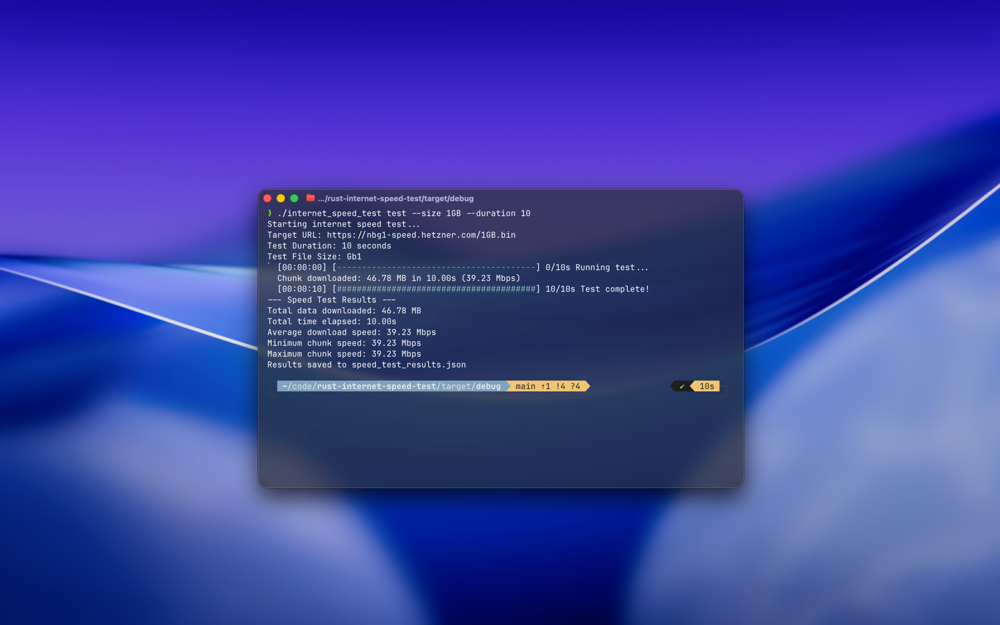

# Internet Speed Test

## Description

This is a simple but effective internet speed test application built with Rust. It measures your download speed by downloading files of various sizes from a Hetzner server. The application calculates the average, minimum, and maximum download speeds and displays the results in the console. It also saves the results to a JSON file for later analysis.

## How it Works

The application works by performing the following steps:

1.  **Parsing Command-Line Arguments:** The application uses the `clap` crate to parse command-line arguments. Users can specify the size of the file to download and the duration of the test.

2.  **Running the Speed Test:** The core of the application is the `run_speed_test` function. This function downloads a file from a specified URL for a given duration. It uses the `reqwest` crate to make HTTP requests and the `indicatif` crate to display a progress bar.

3.  **Calculating Speed:** The application calculates the download speed in megabits per second (Mbps). It also keeps track of the minimum and maximum speeds recorded during the test.

4.  **Displaying Results:** After the test is complete, the application displays the results in the console. This includes the total data downloaded, the total time elapsed, the average download speed, and the minimum and maximum chunk speeds.

5.  **Saving Results:** The application saves the results to a JSON file named `speed_test_results.json`. This file includes a timestamp, the test parameters, and the detailed results.

## Made by

This project was made by [Lucas Thanawat Hagfoss](https://lhagfoss.com).
